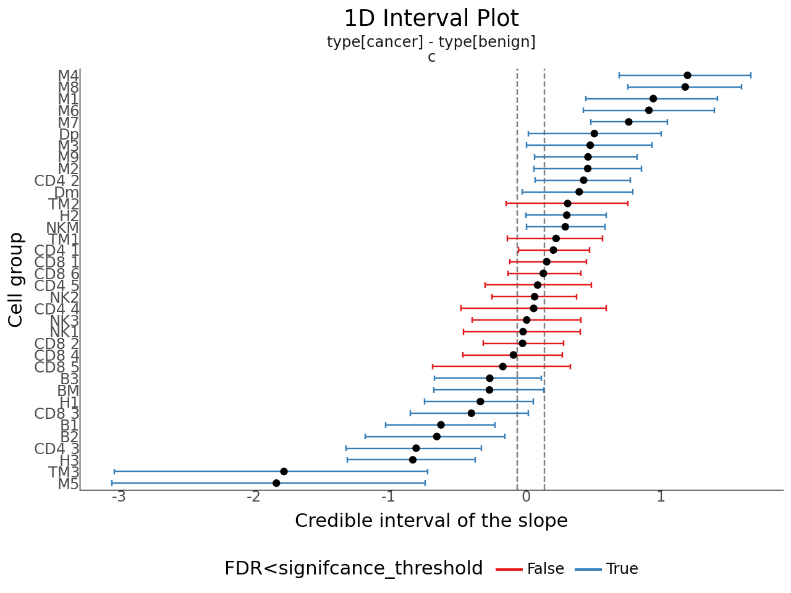

# A Python package for sccomp - Tests differences in cell type proportions and variability from single-cell data
Cellular omics such as single-cell genomics, proteomics, and microbiomics allow the characterization of tissue and microbial community composition, which can be compared between conditions to identify biological drivers. This strategy has been critical to unveiling markers of disease progression in conditions such as cancer and pathogen infections.

For cellular omic data, no method for differential variability analysis exists, and methods for differential composition analysis only take a few fundamental data properties into account. Here we introduce sccomp, a generalised method for differential composition and variability analyses capable of jointly modelling data count distribution, compositionality, group-specific variability, and proportion mean-variability association, while being robust to outliers.

sccomp is an extensive analysis framework that allows realistic data simulation and cross-study knowledge transfer. We demonstrate that mean-variability association is ubiquitous across technologies, highlighting the inadequacy of the very popular Dirichlet-multinomial modeling and providing essential principles for differential variability analysis.

## Cite

Mangiola, Stefano, Alexandra J. Roth-Schulze, Marie Trussart, Enrique Zozaya-Valdés, Mengyao Ma, Zijie Gao, Alan F. Rubin, Terence P. Speed, Heejung Shim, and Anthony T. Papenfuss. 2023. **“Sccomp: Robust Differential Composition and Variability Analysis for Single-Cell Data.”** *Proceedings of the National Academy of Sciences of the United States of America* 120 (33): e2203828120. [https://doi.org/10.1073/pnas.2203828120](https://doi.org/10.1073/pnas.2203828120)

**PNAS** - [*sccomp: Robust differential composition and variability analysis for single-cell data*](https://www.pnas.org/doi/full/10.1073/pnas.2203828120)

## Installation
### Github


```python
pip install git+https://github.com/MangiolaLaboratory/sccompPy.git
```

### Prerequisites: CmdStanPy Installation

`sccompPy` relies on **CmdStanPy**, which serves as an interface to the latest version of **CmdStan**, a powerful tool for Bayesian modeling.

To ensure compatibility, please install and configure **CmdStanPy** before using `sccompPy`. Follow the instructions on the [CmdStanPy documentation](https://mc-stan.org/cmdstanpy/) to install and set up the required dependencies.

Here we provide a demo list some necesary steps:


```python
!pip install --upgrade cmdstanpy

import cmdstanpy
cmdstanpy.install_cmdstan()
```

## Import `sccompy` package 


```python
import sccompPy
```

## Load embeded dataset


```python
import pkg_resources
import pandas as pd

data_file_path = pkg_resources.resource_filename("sccompPy", "data/count_obj.csv")

count_obj = pd.read_csv(data_file_path)
count_obj
```

<div>
<table border="1" class="dataframe">
  <thead>
    <tr style="text-align: right;">
      <th></th>
      <th>sample</th>
      <th>type</th>
      <th>phenotype</th>
      <th>count</th>
      <th>cell_group</th>
      <th>proportion</th>
    </tr>
  </thead>
  <tbody>
    <tr>
      <th>0</th>
      <td>10x_6K</td>
      <td>benign</td>
      <td>b_cell_macrophage_precursor_or_follicular_LTB_...</td>
      <td>42</td>
      <td>BM</td>
      <td>0.008350</td>
    </tr>
    <tr>
      <th>1</th>
      <td>10x_6K</td>
      <td>benign</td>
      <td>B_cell:immature</td>
      <td>361</td>
      <td>B1</td>
      <td>0.071769</td>
    </tr>
    <tr>
      <th>2</th>
      <td>10x_6K</td>
      <td>benign</td>
      <td>B_cell:immature_IGLC3_IGLC2</td>
      <td>57</td>
      <td>B2</td>
      <td>0.011332</td>
    </tr>
    <tr>
      <th>3</th>
      <td>10x_6K</td>
      <td>benign</td>
      <td>B_cell:Memory_ITM2C_IGHA1_MZB1_JCHAIN</td>
      <td>40</td>
      <td>B3</td>
      <td>0.007952</td>
    </tr>
    <tr>
      <th>4</th>
      <td>10x_6K</td>
      <td>benign</td>
      <td>Dendritic_CD11_CD1_high_mito</td>
      <td>75</td>
      <td>Dm</td>
      <td>0.014911</td>
    </tr>
    <tr>
      <th>...</th>
      <td>...</td>
      <td>...</td>
      <td>...</td>
      <td>...</td>
      <td>...</td>
      <td>...</td>
    </tr>
    <tr>
      <th>715</th>
      <td>SRR7244582</td>
      <td>benign</td>
      <td>T_cell:CD8+_GZMK_DUSP2_LYAR_CCL5</td>
      <td>197</td>
      <td>CD8 2</td>
      <td>0.060727</td>
    </tr>
    <tr>
      <th>716</th>
      <td>SRR7244582</td>
      <td>benign</td>
      <td>T_cell:CD8+_non_activated</td>
      <td>320</td>
      <td>CD8 3</td>
      <td>0.098644</td>
    </tr>
    <tr>
      <th>717</th>
      <td>SRR7244582</td>
      <td>benign</td>
      <td>T_cell:CD8+_PPBP_SAT1</td>
      <td>39</td>
      <td>CD8 4</td>
      <td>0.012022</td>
    </tr>
    <tr>
      <th>718</th>
      <td>SRR7244582</td>
      <td>benign</td>
      <td>T_cell:CD8+_S100B</td>
      <td>88</td>
      <td>CD8 5</td>
      <td>0.027127</td>
    </tr>
    <tr>
      <th>719</th>
      <td>SRR7244582</td>
      <td>benign</td>
      <td>T_cell:CD8low_TIMP1_PPBP</td>
      <td>107</td>
      <td>CD8 6</td>
      <td>0.032984</td>
    </tr>
  </tbody>
</table>
<p>720 rows × 6 columns</p>
</div>


## `sccomp_estimate` function


```python
estimate_res = sccompPy.sccomp_estimate(
    data = count_obj,
    formula_composition = '~ 0 + type', 
    sample = 'sample',
    cell_group = 'cell_group',
    count = 'count',
    verbose = False
)
```

    17:05:31 - cmdstanpy - INFO - CmdStan start processing
    chain 1 |          | 00:00 Status
    
    
    chain 1 |▉         | 00:00 Iteration:    1 / 2000 [  0%]  (Warmup)
    
    
    
    
    
    chain 1 |█▎        | 00:00 Iteration:  100 / 2000 [  5%]  (Warmup)
    
    
    chain 1 |█▊        | 00:01 Iteration:  200 / 2000 [ 10%]  (Warmup)
    
    
    chain 1 |██▎       | 00:01 Iteration:  300 / 2000 [ 15%]  (Warmup)
    
    
    chain 1 |██▋       | 00:01 Iteration:  400 / 2000 [ 20%]  (Warmup)
    
    
    chain 1 |███▏      | 00:01 Iteration:  500 / 2000 [ 25%]  (Warmup)
    
    
    chain 1 |███▋      | 00:02 Iteration:  600 / 2000 [ 30%]  (Warmup)
    
    
    chain 1 |████      | 00:02 Iteration:  700 / 2000 [ 35%]  (Warmup)
    
    
    chain 1 |████▌     | 00:02 Iteration:  800 / 2000 [ 40%]  (Warmup)
    
    
    chain 1 |█████     | 00:02 Iteration:  900 / 2000 [ 45%]  (Warmup)
    
    
    chain 1 |█████▉    | 00:02 Iteration: 1001 / 2000 [ 50%]  (Sampling)
    
    
    chain 1 |██████▎   | 00:03 Iteration: 1100 / 2000 [ 55%]  (Sampling)
    
    
    chain 1 |██████▊   | 00:03 Iteration: 1200 / 2000 [ 60%]  (Sampling)
    
    
    chain 1 |███████▎  | 00:03 Iteration: 1300 / 2000 [ 65%]  (Sampling)
    
    
    chain 1 |███████▋  | 00:03 Iteration: 1400 / 2000 [ 70%]  (Sampling)
    
    
    chain 1 |████████▏ | 00:03 Iteration: 1500 / 2000 [ 75%]  (Sampling)
    
    
    chain 1 |████████▋ | 00:04 Iteration: 1600 / 2000 [ 80%]  (Sampling)
    
    
    chain 1 |█████████ | 00:04 Iteration: 1700 / 2000 [ 85%]  (Sampling)
    
    
    chain 1 |█████████▌| 00:04 Iteration: 1800 / 2000 [ 90%]  (Sampling)
    
    
    chain 1 |██████████| 00:04 Sampling completed                       
    chain 2 |██████████| 00:04 Sampling completed                       
    chain 3 |██████████| 00:04 Sampling completed                       
    chain 4 |██████████| 00:04 Sampling completed                       

                                                                                                                                                                                                                                                                                                                                    

    
    17:05:36 - cmdstanpy - INFO - CmdStan done processing.
    17:05:36 - cmdstanpy - WARNING - Non-fatal error during sampling:
    Exception: Exception: beta_binomial_lpmf: First prior sample size parameter[10] is 0, but must be positive finite! (in 'glm_multi_beta_binomial.stan', line 214, column 16 to line 219, column 19) (in 'glm_multi_beta_binomial.stan', line 653, column 3 to line 683, column 8)
    Exception: Exception: beta_binomial_lpmf: First prior sample size parameter[1] is inf, but must be positive finite! (in 'glm_multi_beta_binomial.stan', line 214, column 16 to line 219, column 19) (in 'glm_multi_beta_binomial.stan', line 653, column 3 to line 683, column 8)
    Exception: Exception: beta_binomial_lpmf: First prior sample size parameter[1] is inf, but must be positive finite! (in 'glm_multi_beta_binomial.stan', line 214, column 16 to line 219, column 19) (in 'glm_multi_beta_binomial.stan', line 653, column 3 to line 683, column 8)
    Consider re-running with show_console=True if the above output is unclear!


    


```python
estimate_res.keys()
```


    dict_keys(['fit', 'model_input', 'truncation_df2', 'sample', 'cell_group', 'count', 'formula_composition', 'formula_variability', 'noise_model'])


## `sccomp_test` function
by default `return_all` is set to be `False`, set as `True` to include all info in results


```python
test_res = sccompPy.sccomp_test(estimate_res, contrasts=['type[cancer] - type[benign]'], return_all=True)
```

    Warning: These elements require backquotes: ['type[cancer]', 'type[benign]'], sccompPy will auto quote them.
    Warning: These elements require backquotes: ['type[cancer]', 'type[benign]'], sccompPy will auto quote them.


    /home/chzhan1/Python/SAiGENCI/sccompPy/sccompPy/utilities.py:304: FutureWarning: The default of observed=False is deprecated and will be changed to True in a future version of pandas. Pass observed=False to retain current behavior or observed=True to adopt the future default and silence this warning.
    /home/chzhan1/Python/SAiGENCI/sccompPy/sccompPy/utilities.py:321: FutureWarning: The default of observed=False is deprecated and will be changed to True in a future version of pandas. Pass observed=False to retain current behavior or observed=True to adopt the future default and silence this warning.


### `sccomp_test` returns a `dict` when `return_all=True` where the first element - *result* contains the result table
Otherwise `sccomp_test` will be result table itself


```python
test_res['result']
```


<div>
<table border="1" class="dataframe">
  <thead>
    <tr style="text-align: right;">
      <th></th>
      <th>cell_group</th>
      <th>parameter</th>
      <th>c_lower</th>
      <th>c_effect</th>
      <th>c_upper</th>
      <th>c_pH0</th>
      <th>FDR</th>
      <th>N_Eff</th>
      <th>R_k_hat</th>
      <th>v_lower</th>
      <th>v_effect</th>
      <th>v_upper</th>
      <th>v_pH0</th>
      <th>factor</th>
      <th>design_matrix_col</th>
      <th>count_data</th>
    </tr>
  </thead>
  <tbody>
    <tr>
      <th>0</th>
      <td>B1</td>
      <td>type[benign]</td>
      <td>0.895135</td>
      <td>1.157385</td>
      <td>1.390387</td>
      <td>0.00000</td>
      <td>0.000000</td>
      <td>5933.55</td>
      <td>0.999504</td>
      <td>NaN</td>
      <td>NaN</td>
      <td>NaN</td>
      <td>NaN</td>
      <td>type</td>
      <td>type[benign]</td>
      <td>sample    type        phenotype  co...</td>
    </tr>
    <tr>
      <th>1</th>
      <td>B1</td>
      <td>type[cancer]</td>
      <td>0.138356</td>
      <td>0.489348</td>
      <td>0.808645</td>
      <td>0.01450</td>
      <td>0.001500</td>
      <td>6200.74</td>
      <td>0.999354</td>
      <td>NaN</td>
      <td>NaN</td>
      <td>NaN</td>
      <td>NaN</td>
      <td>type</td>
      <td>type[cancer]</td>
      <td>sample    type        phenotype  co...</td>
    </tr>
    <tr>
      <th>2</th>
      <td>B1</td>
      <td>type[cancer] - type[benign]</td>
      <td>-1.076798</td>
      <td>-0.666984</td>
      <td>-0.268136</td>
      <td>0.00250</td>
      <td>0.000950</td>
      <td>NaN</td>
      <td>NaN</td>
      <td>NaN</td>
      <td>NaN</td>
      <td>NaN</td>
      <td>NaN</td>
      <td>NaN</td>
      <td>NaN</td>
      <td>sample    type        phenotype  co...</td>
    </tr>
    <tr>
      <th>3</th>
      <td>B2</td>
      <td>type[benign]</td>
      <td>0.396715</td>
      <td>0.724280</td>
      <td>1.036206</td>
      <td>0.00050</td>
      <td>0.000071</td>
      <td>5362.59</td>
      <td>0.999425</td>
      <td>NaN</td>
      <td>NaN</td>
      <td>NaN</td>
      <td>NaN</td>
      <td>type</td>
      <td>type[benign]</td>
      <td>sample    type                    p...</td>
    </tr>
    <tr>
      <th>4</th>
      <td>B2</td>
      <td>type[cancer]</td>
      <td>-0.438626</td>
      <td>0.027175</td>
      <td>0.449079</td>
      <td>0.64200</td>
      <td>0.087713</td>
      <td>5983.34</td>
      <td>0.999770</td>
      <td>NaN</td>
      <td>NaN</td>
      <td>NaN</td>
      <td>NaN</td>
      <td>type</td>
      <td>type[cancer]</td>
      <td>sample    type                    p...</td>
    </tr>
    <tr>
      <th>...</th>
      <td>...</td>
      <td>...</td>
      <td>...</td>
      <td>...</td>
      <td>...</td>
      <td>...</td>
      <td>...</td>
      <td>...</td>
      <td>...</td>
      <td>...</td>
      <td>...</td>
      <td>...</td>
      <td>...</td>
      <td>...</td>
      <td>...</td>
      <td>...</td>
    </tr>
    <tr>
      <th>103</th>
      <td>TM2</td>
      <td>type[cancer]</td>
      <td>-1.221164</td>
      <td>-0.896173</td>
      <td>-0.601406</td>
      <td>0.00000</td>
      <td>0.000000</td>
      <td>5764.90</td>
      <td>0.999441</td>
      <td>NaN</td>
      <td>NaN</td>
      <td>NaN</td>
      <td>NaN</td>
      <td>type</td>
      <td>type[cancer]</td>
      <td>sample    type                     ...</td>
    </tr>
    <tr>
      <th>104</th>
      <td>TM2</td>
      <td>type[cancer] - type[benign]</td>
      <td>-0.182896</td>
      <td>0.273352</td>
      <td>0.721949</td>
      <td>0.21475</td>
      <td>0.055604</td>
      <td>NaN</td>
      <td>NaN</td>
      <td>NaN</td>
      <td>NaN</td>
      <td>NaN</td>
      <td>NaN</td>
      <td>NaN</td>
      <td>NaN</td>
      <td>sample    type                     ...</td>
    </tr>
    <tr>
      <th>105</th>
      <td>TM3</td>
      <td>type[benign]</td>
      <td>-1.770492</td>
      <td>-0.824812</td>
      <td>0.244776</td>
      <td>0.09325</td>
      <td>0.017061</td>
      <td>2063.35</td>
      <td>0.999920</td>
      <td>NaN</td>
      <td>NaN</td>
      <td>NaN</td>
      <td>NaN</td>
      <td>type</td>
      <td>type[benign]</td>
      <td>sample    type                     ...</td>
    </tr>
    <tr>
      <th>106</th>
      <td>TM3</td>
      <td>type[cancer]</td>
      <td>-3.890775</td>
      <td>-2.658175</td>
      <td>-1.426470</td>
      <td>0.00000</td>
      <td>0.000000</td>
      <td>1831.74</td>
      <td>1.000070</td>
      <td>NaN</td>
      <td>NaN</td>
      <td>NaN</td>
      <td>NaN</td>
      <td>type</td>
      <td>type[cancer]</td>
      <td>sample    type                     ...</td>
    </tr>
    <tr>
      <th>107</th>
      <td>TM3</td>
      <td>type[cancer] - type[benign]</td>
      <td>-3.090491</td>
      <td>-1.832928</td>
      <td>-0.768404</td>
      <td>0.00075</td>
      <td>0.000333</td>
      <td>NaN</td>
      <td>NaN</td>
      <td>NaN</td>
      <td>NaN</td>
      <td>NaN</td>
      <td>NaN</td>
      <td>NaN</td>
      <td>NaN</td>
      <td>sample    type                     ...</td>
    </tr>
  </tbody>
</table>
<p>108 rows × 16 columns</p>
</div>


## Use function `plot_1D_intervals` to visualise results 
`return_all` needs to set as `True` when run `sccomp_test`


```python
sccompPy.plot_1D_intervals(test_res)
```


    

    

